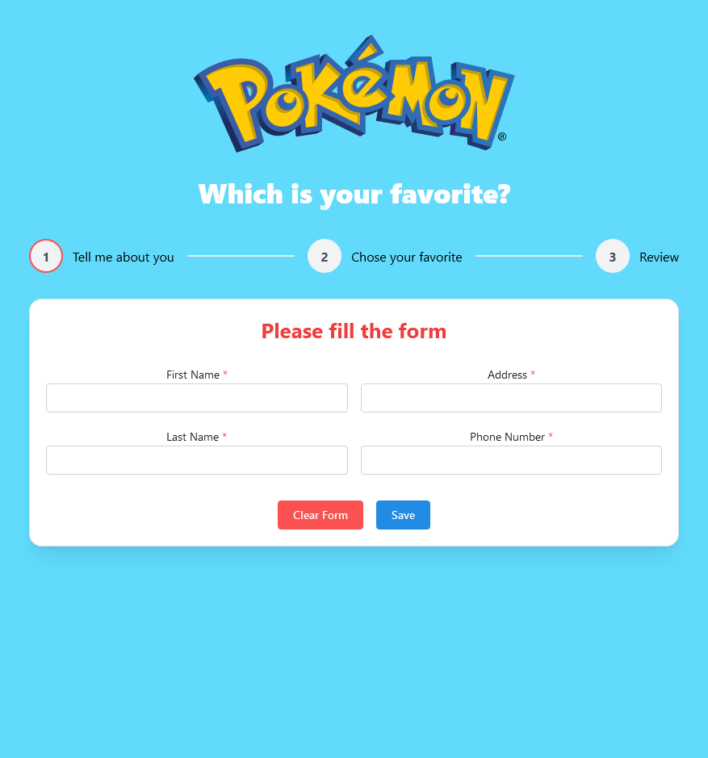
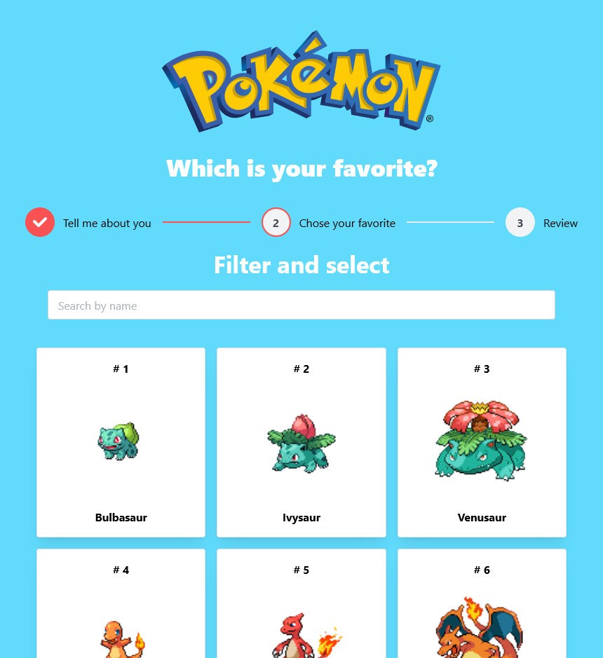
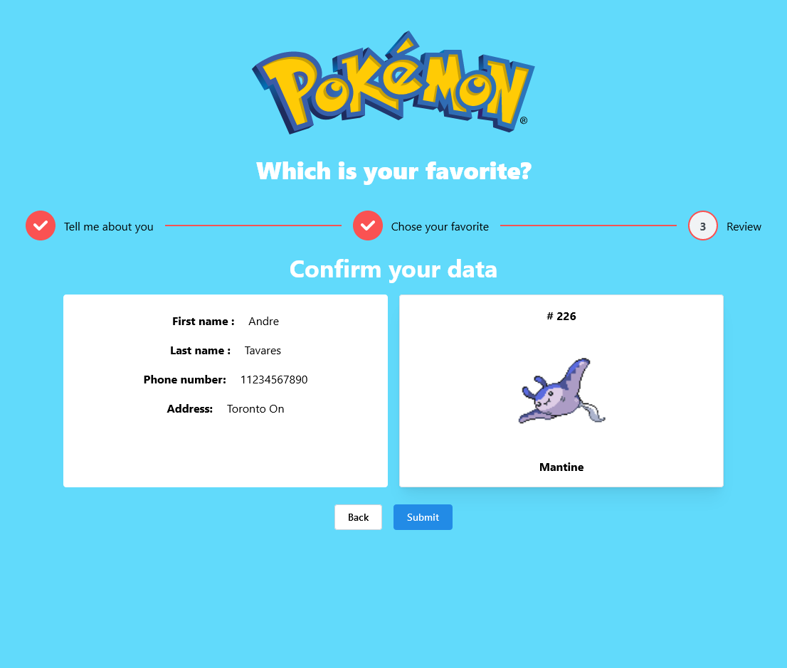

# Documenting My Process

## 1 Understanding the project

- Read the instructions
- Read about the API
- Check some examples

## 2 Sckething a wireframe

- Some drawings for the layout
- Plan possible states to manage
- Find a colour pallet from the pokemon franchise

## 3 Deciding on the stack

- Decide to use the JavaScript starter, because this project although cool, is
  not going to be maintained
- Chose a Ui Lib called Mantine, a lightweight and simple UI, named after a
  pokemon =)
- Added the Styled-components lib for custom CSS
- Added useContext for global state

## 4 Developing

- Made a form, get data from the user and validate using formHook
- Make search pokemon feature with fetch API, didn't see the need to use Axios
- Refactor to use Steppers to create a better user experience
- Refactor the Fetch for reusability and caching data making a custom hook
- Fixing bugs and improving the layout

# Images of the Project

# How to run the project

### `npm install`

to get all the dependencies

### `npm start`

Runs the app in development mode.\
Open [http://localhost:3000](http://localhost:3000) to view it in your browser.

---

## Getting Started with Create React App

This project was bootstrapped with
[Create React App](https://github.com/facebook/create-react-app).

## Learn More

You can learn more in the
[Create React App documentation](https://facebook.github.io/create-react-app/docs/getting-started).

To learn React, check out the [React documentation](https://reactjs.org/).

### Code Splitting

This section has moved here:
[https://facebook.github.io/create-react-app/docs/code-splitting](https://facebook.github.io/create-react-app/docs/code-splitting)

### Analyzing the Bundle Size

This section has moved here:
[https://facebook.github.io/create-react-app/docs/analyzing-the-bundle-size](https://facebook.github.io/create-react-app/docs/analyzing-the-bundle-size)

### Making a Progressive Web App

This section has moved here:
[https://facebook.github.io/create-react-app/docs/making-a-progressive-web-app](https://facebook.github.io/create-react-app/docs/making-a-progressive-web-app)

### Advanced Configuration

This section has moved here:
[https://facebook.github.io/create-react-app/docs/advanced-configuration](https://facebook.github.io/create-react-app/docs/advanced-configuration)

### Deployment

This section has moved here:
[https://facebook.github.io/create-react-app/docs/deployment](https://facebook.github.io/create-react-app/docs/deployment)

### `npm run build` fails to minify

This section has moved here:
[https://facebook.github.io/create-react-app/docs/troubleshooting#npm-run-build-fails-to-minify](https://facebook.github.io/create-react-app/docs/troubleshooting#npm-run-build-fails-to-minify)
